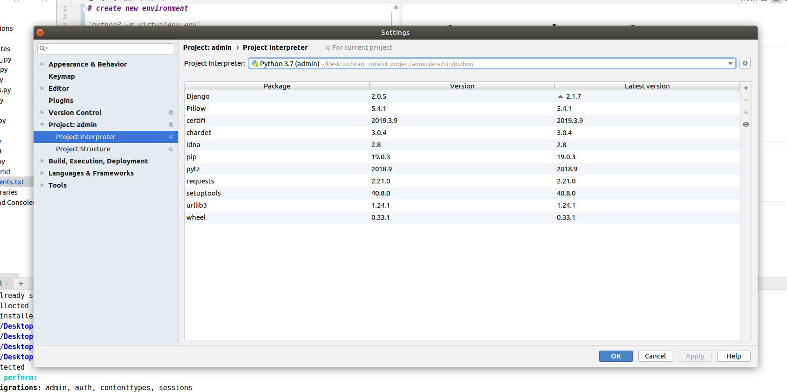

#### create new environment 

```
python3 -m virtualenv env

source env/bin/activate
```




> settings > project: admin >  (click small settings icon) > Add.. > Check existings environment > OK

#### install Requirements

`pip install -r requirements.txt`


#### RUN 

`python manage.py makemigrations && python manage.py migrate` 

`python manage.py runserver`

Open prowser and type: [http://127.0.0.1:8000/raspi](http://127.0.0.1:8000/raspi)

#### Create new application

`python manage.py startapp name_of_your_application`

add 'name_of_your_application' in `settings.py`


# Working with GIT

```git add .```   
push changes


# New App
1. create forms.py from your project (copy paste from sample project only class)


